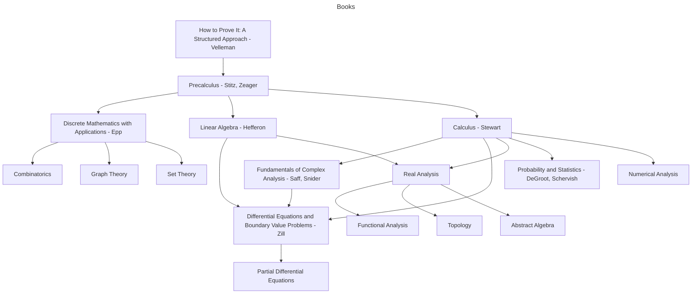

# MathBooks

## Completed

## Ongoing
- How to Prove It: A Structured Approach - Velleman, 3nd Edition.

## Planned
- Precalculus - Stitz, Zeager
- Discrete Mathematics with Applications - Epp
- Linear Algebra - Hefferon
- Calculus - Stewart
- Complex Variables and Applications - Churchill
- Differential Equations and Boundary Value Problems - Zill
- Probability and Statistics - DeGroot, Schervish

## Roadmap
